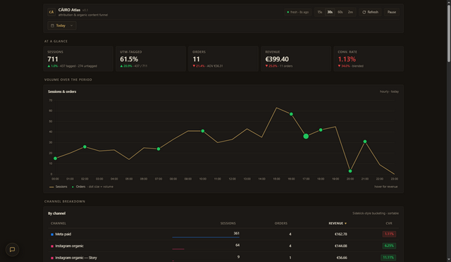

# CĀIRO Atlas

> **Cairo AI's open-source Cowork artifact starter.** Single-file HTML, runs inside Claude.ai's live-artifact runtime, MCP-driven, no build step. The included example is **CĀIRO Atlas** — a Shopify + Metricool + Motion attribution dashboard for a small DTC brand. Fork it, swap the queries, ship your own.



---

## 30-second pitch

- **Single `index.html`.** No bundler, no server. Edit and reload — that's the entire dev loop.
- **Cowork-native.** Calls `window.cowork.callMcpTool(...)` for live data and `window.cowork.askClaude(...)` for an in-artifact chat bubble.
- **Cold-clone friendly.** Every per-fork knob (MCP tool names, brand id, timezone) lives in one `ATLAS_CONFIG` block at the top of the script. Boot probe banners visible setup gaps instead of silent breakage.

> **Single-file constraint.** This is the Cowork artifact contract — the entire app is `index.html`. Don't split into modules or add a bundler. CSS and JS stay inline.

## What's in the example app

CĀIRO Atlas is a live attribution dashboard that auto-refreshes (15s / 30s / 60s / 2m) and unifies three telemetry streams:

- **ATTRIBUTION** — Shopify sessions, orders, revenue, channel breakdown (Sidekick-style buckets with IG Story / Reel / Bio variants), UTM source × medium matrix, top-15 campaigns, funnel snapshot, hourly/daily volume chart.
- **ORGANIC** — Metricool IG Reel + TikTok video reach/engagement (24h-lagged with auto-fallback), reach donut, per-post bars, daily organic chart, Content → Site funnel KPIs.
- **CREATIVE** — Motion Creative Analytics paid Meta creative grading (Best / Underrated / Worst by ROAS + significance, with AI reasoning).
- **CHAT** — floating Cairo AI chat bubble with dynamic suggestions, scoped to the current data snapshot.

Plus drag-and-drop layout (six-dot handle on every KPI tile and panel, persists to localStorage) and a `#error-log` panel (collapsed at page bottom) that surfaces the last 60 events from `atlasLog`.

## Why a "starter"

What you get pre-wired:

- `cowork-artifact-meta` JSON block + `ATLAS_CONFIG` for MCP tool resolution.
- `callTool()` MCP wrapper with rate-limit, timeout, error logging.
- `__atlasBanner()` + `probeCoworkRuntime()` setup diagnostics.
- `safeRender()` / `$()` / `on()` defensive DOM helpers.
- `ChartManager` — Chart.js lifecycle with self-healing cache.
- `LayoutManager` — slot-discovery drag-and-drop with localStorage persistence.
- Refresh loop, freshness pill, pause/resume, custom date range picker.
- In-artifact chat bubble with persistence + dynamic suggestions.

What you replace: the renderers, the queries, the brand styles. See `ARCHITECTURE.md` for the entry points.

---

## Run it cold

This is a Cowork artifact, **not** a static site. The repo is the source-of-truth backup; the runtime lives inside Claude.ai.

### Prerequisites

- **Claude Pro / Max / Team / Enterprise** (free tier can't run live artifacts).
- The MCP servers you want the artifact to talk to. For the included Atlas example:
  - **Shopify** (official `claude.ai` connector) — store admin OAuth.
  - **Metricool** — custom HTTP MCP at `https://ai.metricool.com/mcp`. Metricool Advanced+ plan required. ([install docs](https://help.metricool.com/en/article/how-to-connect-metricools-mcp-1364s63/))
  - **Motion Creative Analytics** (official `claude.ai` connector) — Motion paid workspace.

### Steps

1. **Clone** the repo.
   ```sh
   git clone https://github.com/eliasfelix1000-web/Cairo-Atlas.git
   cd Cairo-Atlas
   ```

2. **Open in Claude Code** (or any AI coding tool). Claude reads `CLAUDE.md` automatically when you launch the CLI in this directory; that file is the working contract that lets Claude help with the rest of setup.

3. **Connect the MCP servers** in Claude.ai → Settings → Connectors. OAuth into each one. Verify they appear and are authenticated.

4. **Create a Cowork project**, then start a task. Inside the task:

   > "Create a live artifact named *CĀIRO Atlas* using the contents of `index.html` as the source. Don't edit, just paste it in verbatim."

5. **Approve the artifact's MCP connections** when prompted. Each user has to approve their own — connections do not transfer from the original author.

6. **Discover your tool names.** Open the live artifact's browser devtools console and inspect:
   ```js
   window.cowork           // confirms the runtime is present
   window.ATLAS_CONFIG.mcp // the names this artifact tries to use
   ```
   Compare against the tool names registered to *your* Cowork project (ask the parent Cowork chat: *"List the MCP tools available to this artifact."*). If the names differ — they almost certainly will, since the original UUID prefixes are tied to the original author's MCP server instances — proceed to step 7.

7. **Update `ATLAS_CONFIG`** at the top of `index.html` (search for `ATLAS_CONFIG = Object.freeze`). Replace the `mcp.*` strings with your tool names. Also update `metricoolBlogId`, `shopTz`, `storagePrefix` if forking under a new brand. Also update the `mcpTools` array in the `cowork-artifact-meta` JSON block at the very top of the file.

8. **Reload the artifact.** If the runtime is missing or Chart.js failed to load, you'll see a top-of-page banner. Otherwise, watch the `#error-log` panel — error count should stay at 0 once data flows.

### Diagnostic commands (in the artifact's devtools console)

| Check | Command | Healthy result |
|---|---|---|
| Cowork runtime present | `typeof window.cowork === 'object'` | `true` |
| Config visible | `window.ATLAS_CONFIG` | object with `mcp.shopifyAnalytics` etc. |
| Tool resolves | `await window.cowork.callMcpTool(window.ATLAS_CONFIG.mcp.shopifyAnalytics, {})` | response object (even if it errors on missing args, that's fine — means the *tool name* resolved) |
| Last 60 events | `CairoAtlas.api.logs` | array; `0` errors after first refresh |
| Force refresh | `CairoAtlas.dashboard.refresh()` | promise resolves; KPIs update |

If a check fails, read the matching section in `STACK.md` → "Troubleshooting".

---

## Required MCP servers

| Server | Connector path | Plan |
|---|---|---|
| Shopify | claude.ai → Settings → Connectors → Shopify (OAuth) | Claude Pro+ + Shopify store admin |
| Motion Creative Analytics | claude.ai → Settings → Connectors → Motion (OAuth) | Claude Pro+ + Motion paid workspace |
| Metricool | claude.ai → Settings → Connectors → Custom MCP, HTTP transport `https://ai.metricool.com/mcp` | Claude Pro+ + Metricool Advanced+ |

For alternatives (Klaviyo, Google Analytics, custom self-hosted MCPs), see `STACK.md` → "Alternatives by category".

---

## For Claude Code sessions

> **Claude Code: read [`CLAUDE.md`](CLAUDE.md) before doing anything in this repo.** It's the working contract — codebase rules (single-file, `node --check` validation), the MCP-UUIDs-are-per-user warning, and a section specifically for the original maintainer's preferences. Skipping it leads to broken commits.

---

## Project layout

```
index.html         the artifact — entire app lives here (~4500 lines)
versions/          historical snapshots from the Cowork iteration history
README.md          this file
CLAUDE.md          working contract for Claude sessions
STACK.md           runtime deps, MCP connection map, UUID swap procedure
ARCHITECTURE.md    code structure: singletons, refresh loop, error surface
CHANGELOG.md       every patch, with the why
LICENSE            MIT
.gitattributes     LF enforcement (Cowork meta JSON is line-ending-sensitive)
.editorconfig      indent + encoding for editors
```

---

## Stack

- Single-file HTML, no build step, no framework.
- Chart.js 4.5.0 UMD via jsDelivr (only CDN dependency).
- Vanilla JS in strict mode. CSS custom properties.
- Module-singleton structure (`ATLAS`, `STATE`, `CHAT`, `DR`, `ChartManager`, `LayoutManager`) — see `ARCHITECTURE.md`.
- localStorage for persistence (`cairo_*` keyspace; rename via `ATLAS_CONFIG.storagePrefix` on fork).

Full dep map: [`STACK.md`](STACK.md) · code structure: [`ARCHITECTURE.md`](ARCHITECTURE.md) · history: [`CHANGELOG.md`](CHANGELOG.md).

---

## Roadmap

- Tool-resolution self-test on boot (call every `ATLAS_CONFIG.mcp.*` once, banner anything that doesn't resolve).
- `renderBreakdownTable()` consolidation (channel/source/medium/campaigns are ~90% identical).
- Vendored Chart.js fallback for environments where jsDelivr is blocked.
- CVR-units standardization (kpi vs row inconsistency — see `ARCHITECTURE.md` → "Known sharp edges").

Issues and PRs welcome.

---

## Credits

Built by [Cairo AI](https://github.com/eliasfelix1000-web) with [Claude Code](https://claude.com/claude-code). The CĀIRO Atlas example app is the live attribution dashboard for the CĀIRO jewellery brand — that's the use case it's been hardened against.

## License

[MIT](LICENSE) — fork it, ship it, sell it. Attribution appreciated, not required.
